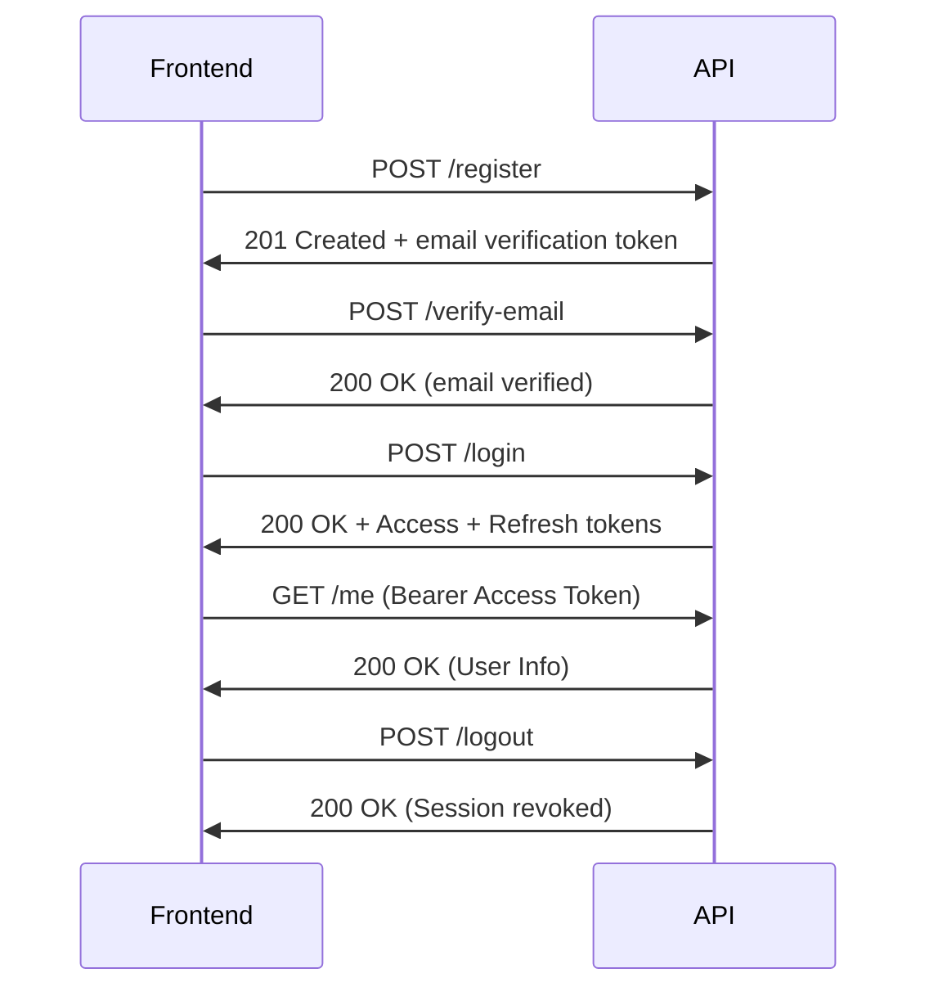

# 🔐 Vaultless Authentication API Documentation

This document describes all authentication-related endpoints in the Vaultless API.  
It follows REST and security best practices, supporting JSON-based communication and JWT authentication.

---

## 📘 Overview

| Category | Description |
|-----------|--------------|
| Base URL  | `https://api.vaultless.app` (Production) / `http://localhost:8000` (Development) |
| Content Type | `application/json` |
| Auth Mechanism | JWT (Bearer Token) |
| Rate Limiting | Handled globally and per-route using `tower-governor` |
| Security | Password hashing with Argon2 / bcrypt, short-lived access tokens, refresh tokens stored in cache (Dragonfly or Redis) |

---

## 🧱 Authentication Flow Summary



---

## 🧩 Endpoints

### 1. Register a New User
`POST /register`

Registers a new user and generates an email verification token.

#### Request Body
```json
{
  "email": "user@example.com",
  "password": "supersecurepassword",
  "name": "John Doe"
}
```

#### Response – `201 Created`
```json
{
  "email": "user@example.com",
  "message": "Registration successful. Please check your email to verify your account."
}
```

---

### 2. Verify Email
`POST /verify-email`

Completes the verification of a newly registered user.

#### Request
```json
{
  "token": "eyJhbGciOiJIUzI1NiIs..."
}
```

#### Response – `200 OK`
```json
{
  "message": "Email verified successfully",
  "email": "user@example.com"
}
```

---

### 3. Login
`POST /login`

Authenticates a user and returns a JWT access and refresh token pair.

#### Request
```json
{
  "email": "user@example.com",
  "password": "supersecurepassword"
}
```

#### Response – `200 OK`
```json
{
  "access_token": "eyJhbGciOiJIUzI1...",
  "refresh_token": "eyJhbGciOiJIUzI1...",
  "token_type": "Bearer",
  "expires_in": 3600,
  "user": {
    "email": "user@example.com",
    "name": "John Doe",
    "email_verified": true,
    "is_admin": false
  }
}
```

---

### 4. Request Password Reset
`POST /password/request-reset`

Generates a temporary password reset token for an active account.

#### Request
```json
{
  "email": "user@example.com"
}
```

#### Response – `200 OK`
```json
{
  "message": "Password reset token generated successfully."
}
```

#### Error – `404 Not Found`
```json
{
  "error": "No active account found for the provided email"
}
```

---

### 5. Reset Password
`POST /password/reset`

Resets a user’s password using a valid token.

#### Request
```json
{
  "token": "eyJhbGciOiJIUzI1NiIs...",
  "new_password": "newsecurepassword"
}
```

#### Response – `200 OK`
```json
{
  "message": "Password reset successfully. Please log in with your new password."
}
```

---

### 6. Get Current User
`GET /me`

Returns the authenticated user’s profile information.

#### Headers
```
Authorization: Bearer <access_token>
```

#### Response – `200 OK`
```json
{
  "user": {
    "email": "user@example.com",
    "name": "John Doe",
    "email_verified": true,
    "is_admin": false
  }
}
```

---

### 7. Logout
`POST /logout`

Invalidates all active sessions for the current user.

#### Headers
```
Authorization: Bearer <access_token>
```

#### Response – `200 OK`
```json
{
  "message": "Logged out successfully"
}
```
